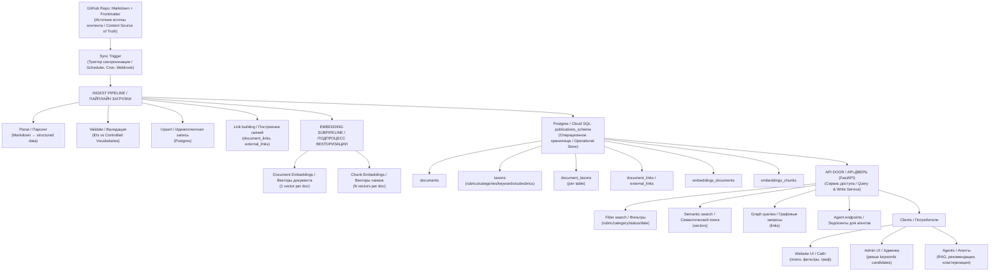

# Knowledge Substrate

```mermaid
flowchart TD
    A["GitHub Repo: Markdown + Frontmatter\n(Источник истины контента / Content Source of Truth)"] --> B["Sync Trigger\n(Триггер синхронизации / Scheduler, Cron, Webhook)"]
    B --> C["INGEST PIPELINE / ПАЙПЛАЙН ЗАГРУЗКИ"]

    C --> C1["Parse / Парсинг\n(Markdown → structured data)"]
    C --> C2["Validate / Валидация\n(IDs vs Controlled Vocabularies)"]
    C --> C3["Upsert / Идемпотентная запись\n(Postgres)"]
    C --> C4["Link building / Построение связей\n(document_links, external_links)"]
    C --> C5["EMBEDDING SUBPIPELINE / ПОДПРОЦЕСС ВЕКТОРИЗАЦИИ"]

    C5 --> C51["Document Embeddings / Векторы документа\n(1 vector per doc)"]
    C5 --> C52["Chunk Embeddings / Векторы чанков\n(N vectors per doc)"]

    C --> D["Postgres / Cloud SQL: publications_schema\n(Операционное хранилище / Operational Store)"]
    D --> D1[documents]
    D --> D2["taxons\n(rubrics/categories/keywords/subrubrics)"]
    D --> D3["document_taxons\n(join table)"]
    D --> D4[document_links / external_links]
    D --> D5[embeddings_documents]
    D --> D6[embeddings_chunks]

    D --> E["API DOOR / API-ДВЕРЬ (FastAPI)\n(Сервис доступа / Query & Write Service)"]
    E --> E1["Filter search / Фильтры\n(rubric/category/status/date)"]
    E --> E2["Semantic search / Семантический поиск\n(vectors)"]
    E --> E3["Graph queries / Графовые запросы\n(links)"]
    E --> E4["Agent endpoints / Эндпоинты для агентов"]

    E --> F[Clients / Потребители]
    F --> F1["Website UI / Сайт\n(поиск, фильтры, граф)"]
    F --> F2["Admin UI / Админка\n(ревью keywords candidates)"]
    F --> F3["Agents / Агенты\n(RAG, рекомендации, кластеризация)"]
```
