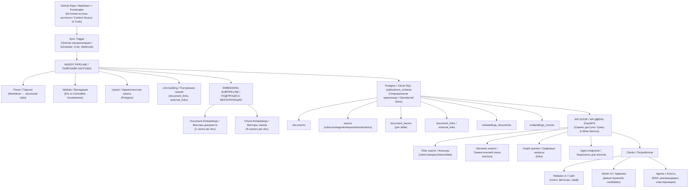

# DET / DETai — Knowledge Core

Knowledge Core — это центральный контур экосистемы **DET / DETai**, в котором зафиксированы:
- канон знаний (Source of Truth),
- правила их структурирования,
- пайплайны преобразования,
- операционное хранение и сервисы доступа.

Ниже — общий обзор уровней и взаимосвязей, а также схема, показывающая поток данных от канона к производным системам.

## Общая схема

## Основные уровни и разделы

### 1. Source of Truth — канон знаний
- Каталог `source_of_truth/` содержит **первичные канонические документы**, метаданные и словари.
- Здесь же определены **схемы как контракты** — правила фиксации, идентификации и связи информации.
- Папка `source_of_truth/docs/` одновременно служит **базой знаний** и **витриной MkDocs**.

Подробнее: `knowledge_core/source_of_truth/README.md`.

### 2. Ingest Pipeline — преобразование канона
- Каталог `ingest_pipeline/` описывает процесс парсинга, валидации и загрузки данных.
- Здесь задаются правила трансформации Markdown в структурированные записи,
  а также вспомогательные политики для последующей индексации и RAG.

### 3. Operational Store — рабочие представления
- Каталог `operational_store/` хранит модели и структуры данных,
  которые используются в **операционных БД** и сервисах доступа.
- Это производный слой: он полностью воспроизводим из Source of Truth.

---

Если требуется менять структуру уровней, сначала согласуйте общую схему и роли разделов,
затем обновляйте детали на уровне конкретных подпапок.
