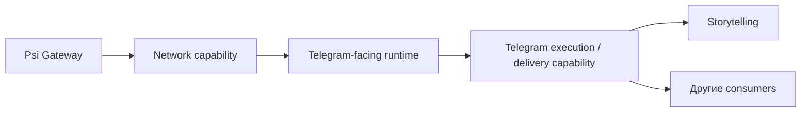

# 🧭 Принципы инфраструктуры

**Infrastructure** — специализированная оптика на техническую основу
экосистемы: инфраструктурные системы, вычислительные среды, данные и связи
между ними. Она не описывает продуктовый смысл целиком, а показывает, как он
получает надёжную исполняемую форму. Работа над этой формой следует принципам,
которые помогают создавать, поддерживать и расширять её без смешения владельцев.

#### 1️⃣ Принцип наглядности

**Принцип наглядности** означает, что **вся инфраструктура должна быть наглядной** и понятной для всех участников экосистемы. Важно, чтобы при взгляде на структуру данных, процессов или взаимодействий было сразу понятно:

- **Что именно происходит** в системе.
- **Как эта информация и процессы связаны**.
- **Как это влияет** на другие части экосистемы.

Это не просто о том, чтобы она была видимой — важно, чтобы она была **интуитивно понятной**, так чтобы каждый мог **легко ориентироваться** в системе.

Пример: **графы** и **взаимосвязи** в экосистеме. Хороший граф позволяет увидеть не только элементы, но и направление зависимости, владельца ответственности и контракт между ними.

#### 2️⃣ Принцип навигации

**Принцип навигации** подразумевает, что инфраструктурное описание должно помогать быстро перейти от общей схемы к нужному источнику истины: системе, среде исполнения, operational-карте или owning repository.

Это значит, что:

- данные и связи организуются так, чтобы поддерживать эффективную навигацию;
- схема показывает не только «что связано», но и **где искать каноническую логику, operational state и реализацию**;
- одна и та же информация не дублируется без необходимости между Knowledge Substrate, operational Infrastructure и runtime-средами.

#### 3️⃣ Принцип системности

**Принцип системности** означает, что инфраструктура должна быть согласованной, а границы её частей — совместимыми. Системность не требует собрать всё в один проект. Напротив, согласованная экосистема может состоять из самостоятельных владельцев, если между ними существуют понятные contracts и отсутствует скрытое дублирование ответственности.

#### 4️⃣ Принцип адаптивности

**Принцип адаптивности** означает, что инфраструктура должна быть гибкой и масштабируемой. Компонент можно переносить между машинами, provider можно заменить другой реализацией, а новая среда исполнения не должна требовать переписывать предметную логику только из-за изменения deployment.

Именно поэтому [среда исполнения](execution-environments/index.md) отвечает на вопрос «где это работает», но сама по себе не становится владельцем логики.

---

## 5️⃣ Принцип infrastructure capabilities и стабильных контрактов

Infrastructure следует рассматривать не только как набор систем и машин, но и как слой, который предоставляет другим контурам **повторно используемые технические возможности — infrastructure capabilities**.

> **Infrastructure Capability** — техническая возможность, предоставляемая инфраструктурным контуром другим системам через стабильный контракт. Consumer зависит от смысла и интерфейса этой возможности, но не от конкретной внутренней реализации provider.

Ключевая формула:

> **Система зависит от infrastructure capability, а не от конкретной машины, на которой эта capability сегодня реализована.**

### Provider–consumer — это граф, а не организационная иерархия

Provider предоставляет capability. Consumer использует её через контракт. Это не делает provider «начальником» consumer и не означает вложенность проектов.



Один provider может обслуживать несколько consumers, а один consumer может одновременно использовать несколько capabilities. Поэтому архитектура естественно образует граф зависимостей, а не дерево организационного подчинения.

### Среда исполнения не становится обязательным посредником

Физическое размещение не добавляет новый логический слой в dependency chain.

Например, Telegram-facing компонент сегодня может исполняться на DETai Nexus и использовать сетевую capability Psi Gateway. Это не означает архитектуру:

```text
Telegram component
→ DETai Nexus as logical service
→ Psi Gateway
```

Правильное разделение выглядит так:

```text
Telegram component @ DETai Nexus
→ Network capability contract
→ Psi Gateway implementation
```

Если тот же компонент завтра переносится на внешний сервер, его предметная логика не должна меняться только из-за смены execution environment:

```text
сегодня:
component @ DETai Nexus
→ Network capability

завтра:
component @ another execution environment
→ Network capability
```

Таким образом, execution environment размещает provider или consumer, но сам факт размещения не делает среду владельцем чужой логики или обязательным middleware.

### Provider знает только необходимый infrastructure context

Между слоями действует принцип минимального знания.

Network provider может знать, например:

```text
profile_id
logical location
private endpoint
health
egress country
routing / failover state
capabilities
```

Но ему не требуется знать прикладные сущности consumer: конкретный Telegram account, публикацию Storytelling, пользовательскую сессию или смысл задачи.

Consumer, наоборот, может знать:

```text
account / workload
→ network_profile = <profile_id>
```

но не должен зависеть от внутреннего proxy/VPN stack, конкретного upstream-узла, unit-файла или другого implementation detail provider.

### Infrastructure-owned и consumer-owned policy разделяются

Один UI может показывать данные сразу нескольких владельцев, но это не смешивает ownership.

Например, условная карточка Network Profile может объединять:

```text
Profile: vpn-finland
Location: Finland
Slots: 1 / 4
Priority: 10
Status: Healthy
```

Infrastructure-owned поля:

```text
profile_id
logical location
private endpoint
health
egress country
capabilities
```

Consumer-owned policy:

```text
priority
max_accounts
assigned accounts
sticky assignment
```

То есть `max_accounts = 4` не обязано означать физическую ёмкость Gateway. Это может быть прикладная policy конкретного consumer по использованию данной capability. Другой consumer вправе использовать тот же Network Profile по другим правилам.

### Logical Network Profile стабилен относительно сменяемой реализации

Логический профиль вроде:

```text
vpn-finland
```

обозначает смысл capability, а не обещание одного неизменного IP или одного конкретного upstream.

Infrastructure может выполнить same-location failover:

```text
Finland-A
→ failure
→ Finland-B
```

и consumer продолжит видеть тот же `vpn-finland`, пока сохраняется договорённый смысл capability — например, логический egress из Finland.

Но незаметная автоматическая подмена:

```text
Finland
→ Germany
```

уже меняет семантику capability и не должна маскироваться под тот же профиль, если location является частью контракта.

### Psi Gateway как reusable Network Provider

[Psi Gateway](home-lab/architecture.md) отвечает за сетевой контур Home Ψ Lab. В provider–consumer модели его роль шире одного Telegram-сценария: он может предоставлять reusable network capabilities для разных consumers.

К таким возможностям относятся, в зависимости от реализации:

```text
regional egress
private proxy / tunnel endpoints
routing
network health
same-location failover
private tunnels
DNS / network policy
```

Telegram является хорошим первым объясняющим примером consumer, но не владельцем сетевой capability. В дальнейшем тот же контракт могут использовать workers, API clients, research services и другие runtime-компоненты.

При этом конкретная Telegram runtime-логика сохраняет действующего владельца. Общие bot/API/runtime-процессы и общие данные DETai принадлежат [ecosystem-runtime](ecosystem-runtime/index.md); наличие Telegram как канала не переносит эту ответственность в Gateway или execution environment.

---

## Operational source of truth: `DETai-org/Infrastructure`

Каноническая концептуальная модель Infrastructure живёт в Knowledge Substrate, а существующий Git repository `DETai-org/Infrastructure` выполняет другую роль: это **version-controlled operational source of truth инфраструктурного домена**.

Важно различать:

```text
Git repository
≠
Linux machine
```

и также:

```text
Git repository
≠
Infrastructure System
```

Репозиторий фиксирует reviewable и воспроизводимые operational-артефакты: инвентаризацию сред, технические карточки, эксплуатационные документы, shared scripts и те deployment/configuration assets, которым действительно нужен Git lifecycle. Он может указывать на machine-local source of truth там, где состояние конкретного host не должно дублироваться в репозитории.

Текущая внутренняя структура `DETai-org/Infrastructure` является **implementation detail**, а не частью вечной онтологии DETai. Она может меняться по мере того, как появляются новые среды, operational patterns и способы configuration management. Канон фиксирует назначение и границы repository, а не навсегда закрепляет сегодняшнее дерево каталогов.

### Почему это не четвёртая Infrastructure System

В [каноне инфраструктурных систем](infrastructure-systems/index.md) Infrastructure System — самостоятельная reusable technical system, которая владеет собственной технической логикой и/или данными.

`DETai-org/Infrastructure` не становится такой системой только потому, что у него есть Git history. Он является operational source of truth для инфраструктурного домена и execution environments: описывает и сопровождает их состояние, но не добавляет новый runtime/API/business capability сам по факту существования repository.

Иными словами:

> Наличие собственного repository может быть свойством системы, но наличие repository само по себе не создаёт новую систему.

### Git source of truth и runtime state — разные вещи

```text
Infrastructure repository
→ versioned / reviewable desired and operational state

execution environment
→ actual runtime state
```

В Git допустимо хранить, если это соответствует operational policy:

```text
configuration templates
safe deployment code
service templates
health-check logic
inventory schemas
recovery procedures
shared scripts
documentation
.env.example
```

В Git не принадлежат:

```text
real credentials
private keys
tokens
VPN / proxy secrets
runtime databases
logs
cache
mutable live state
```

Конкретное распределение между repository и machine-local configuration может развиваться. Архитектурно важна граница: Git хранит versioned артефакт и намерение, а не притворяется самой работающей машиной.

### Один repository может обслуживать несколько environments

Один operational source of truth может иметь рабочие копии или deployment artifacts на нескольких машинах и рабочих станциях. Каждый host использует только относящуюся к нему часть.

Позже это может быть реализовано через обычный checkout, sparse checkout, CI/CD, deployment artifacts или configuration-management tooling. Выбор механизма является implementation detail и не меняет provider–consumer модель.

---

## Как этот принцип помогает экосистеме

Provider–consumer модель делает зависимости явными и переносимыми:

- Network capability можно переиспользовать несколькими consumers;
- смена execution environment не обязана менять предметную логику;
- provider не получает бизнес-контекст, который ему не нужен;
- consumer не зависит от сменяемой внутренней реализации provider;
- UI может объединять данные разных владельцев, не смешивая ownership;
- operational repository фиксирует инфраструктурные артефакты, не превращаясь в новую runtime-систему.

Для Home Ψ Lab это продолжает уже принятую границу: Psi Gateway отвечает за сеть и связность, DETai Nexus — за вычислительную среду, а самостоятельные системы и продукты сохраняют собственную логику независимо от того, где именно они сегодня запущены.
