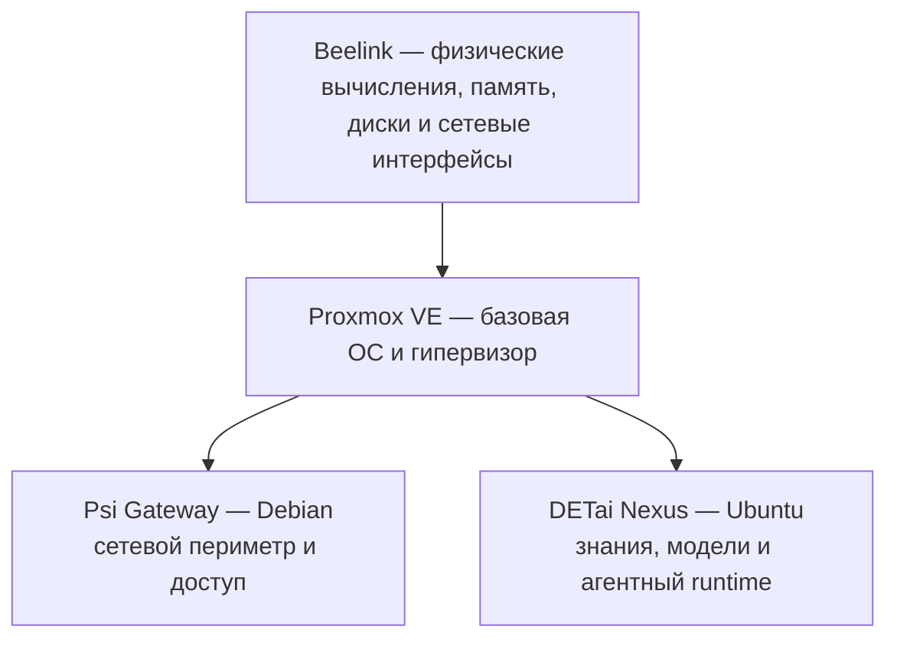

# Архитектура и состав Home Ψ Lab

Home Ψ Lab состоит не только из физического мини-ПК. Это связка оборудования,
базовой среды Proxmox VE и двух изолированных гостевых операционных систем.
Такой состав принят и работает как версия 1.0.

## Устройство версии 1.0

| Уровень | Реализация | Ответственность |
|---|---|---|
| Физическая основа | Мини-ПК Beelink | Предоставляет вычислительные, дисковые и сетевые ресурсы лаборатории |
| Базовая среда | Proxmox VE | Управляет виртуальными ресурсами, изоляцией и жизненным циклом гостевых систем |
| Сетевой контур | Psi Gateway, Debian | Завершает внешний сетевой вход, применяет сетевую политику и обеспечивает локальный доступ |
| Вычислительный контур | DETai Nexus, Ubuntu | Предоставляет Linux-среду для моделей, знаний, retrieval, enrichment и прикладных компонентов |

Формулу «операционная система, которая создаёт операционные системы» полезно
понимать как простую метафору. Proxmox — установленная на физическом узле
Linux-среда и гипервизор: он создаёт виртуальные машины, выделяет им ресурсы и
запускает внутри каждой собственную гостевую ОС. Поэтому один компьютер может
поддерживать несколько логически отдельных систем.

## Почему Gateway и Nexus разделены

Psi Gateway и DETai Nexus различаются не только названиями, но и классом
ответственности.

- Gateway относится к базовой связности: его задача — предсказуемо и безопасно
  соединять локальную лабораторию с внешними сетями.
- Nexus относится к вычислительной и смысловой работе: модели, индексы,
  обработка знаний и агентные процессы могут развиваться быстрее и чаще
  меняться.

Изоляция не устраняет все общие риски одного физического хоста, но сокращает
область влияния программных изменений. Эксперимент или обновление в Nexus не
должны автоматически менять сетевую политику Gateway. Сетевой компонент, в
свою очередь, не получает прикладные данные и функции только потому, что обе
системы используют одно оборудование.

После фиксации Home Ψ Lab v1.0 эти контуры имеют отдельные циклы развития:
общая лаборатория отвечает за физическую основу и Proxmox, Psi Gateway — за
сеть и защищённую связность, DETai Nexus — за вычислительную и агентную среду.

## Внутренняя архитектура DETai Nexus

DETai Nexus является функциональным контуром, а не отдельным репозиторием-
контейнером. Его слои имеют разных владельцев:

| Слой | Владелец | Содержимое |
| --- | --- | --- |
| Product semantics | соответствующий продукт | Prompts, request/response contracts, human review и product-specific schemas |
| Intelligence runtime | `intelligence-runtime` | Model orchestration, routing, deterministic validators, provider roles и scenario manifests |
| Shared application runtime | `ecosystem-runtime` | Общие operational services и schemas экосистемы |
| Knowledge | Knowledge Substrate | Канонические документы, retrieval-ready knowledge и `detai_core` |
| Machine deployment | Infrastructure | systemd, порты, GPU/RAM, модели, inference runtime, PostgreSQL/Qdrant и backup |
| Mutable scenario state | исполняемый сценарий | Runs, resumable cache, traces и archive вне Git |

Репозитории остаются самостоятельными источниками истины, а Infrastructure
связывает их на конкретной машине.

### Контур обработки Storytelling

Storytelling передаёт в DETai Nexus собственные contracts и staged prompts.
Intelligence runtime распределяет функциональные роли между доступными LLM:
routing, enrichment, перевод, адресный repair, SEO/metadata и semantic
classification. Детерминированные validators остаются авторитетными, а
результат возвращается в Storytelling на human review.

Конкретные семейства и количество моделей, а также текущее распределение ролей
между ними не являются частью канонической архитектуры: эти параметры меняются
по результатам benchmark и фиксируются в versioned scenario manifests и
конфигурации `intelligence-runtime`. Развёрнутые inference runtime и модели
учитываются в операционной документации Infrastructure.

Resumable cache является состоянием сценария и не переносится в SQL.

### Данные и память

PostgreSQL и Qdrant имеют отдельные постоянные области данных и не смешиваются
с Git checkout или scenario cache.

- `detai_core` принадлежит Knowledge Substrate;
- общие operational schemas `detai_projects` принадлежат
  `ecosystem-runtime`;
- product-specific schemas принадлежат соответствующим продуктам;
- Qdrant хранит векторные проекции по versioned retrieval contracts, а не
  неструктурированные копии runtime cache.

Веса моделей и inference binaries являются общими машинными ресурсами. Код
сценария ссылается на model roles, поэтому физическую модель можно менять через
конфигурацию и benchmark без переноса продуктовой семантики.

## Архитектурные принципы

### Собственная основа без изоляционизма

Лаборатория не ставит цель самостоятельно воспроизвести каждый облачный сервис
или отказаться от внешних моделей. Её задача — сделать зависимости явными и
управляемыми. Критически важные знания, версии, правила и данные должны
сохранять переносимость, а внешние компоненты — иметь понятную границу и, где
это практически возможно, путь замены.

### Техника подчинена смыслу и ответственности

Инфраструктура психотерапевтической экосистемы не нейтральна: способы хранения,
доступа, поиска и автоматизации влияют на то, какие различия система замечает
и кому отдаёт право решения. Поэтому собственная вычислительная среда важна не
сама по себе. Она создаёт место, где команда может осознанно проектировать
технологию вокруг метода, человеческой субъектности и профессиональной
ответственности.

### Инфраструктура — длительное обязательство

Готовность версии 1.0 означает, что базовая архитектура собрана и работает, а
не что работа завершена навсегда. Узел требует обновлений, мониторинга,
резервного копирования, проверки восстановления, управления доступом и
документирования изменений. Эти процессы относятся к эксплуатации и не
раскрываются на публичной странице.

Home Ψ Lab остаётся частью распределённой Infrastructure. Перенос stateful-
сервиса включает проверяемый backup, изолированный restore, отдельный cutover и
ограниченный период read-only fallback; создание копии данных само по себе не
является cutover.

## Граница документа

Публично фиксируются назначение уровней, операционные системы, разделение
ответственности и устойчивые архитектурные принципы. Hostnames, IP-адреса,
учётные данные, ключи, точная сетевая топология, конфигурации, команды и журналы
работ остаются во внутренних системах ClickUp и Infrastructure согласно
[документационной архитектуре DETai](../../Management_layer/Docs-Ecosystem/documentation-architecture.md).
