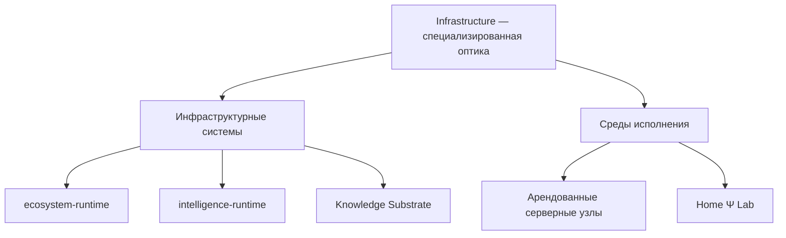

# Infrastructure

Infrastructure — это специализированная оптика, через которую экосистема
рассматривает техническую основу своей работы: исполняемый код, данные,
вычислительные среды, связи между ними и границы ответственности. Она не
подменяет продуктовую карту DETai и не превращает всё увиденное в один проект.

## Два вида объектов

Внутри этой оптики есть два больших направления: **инфраструктурные системы**
и **среды исполнения**.

### Инфраструктурные системы

Это самостоятельные versioned-контуры, которые владеют технической логикой и
данными. В текущей архитектуре таких систем три:

- [ecosystem-runtime](ecosystem-runtime/index.md) обеспечивает общие живые
  процессы экосистемы: API, ботов, workers и runtime-данные;
- [intelligence-runtime](intelligence-runtime/index.md) обеспечивает
  повторно используемое исполнение LLM-сценариев;
- [Knowledge Substrate](Knowledge_Substrate/index.md) хранит и материализует
  каноническое знание экосистемы.

Их общая граница раскрыта в разделе
[«Инфраструктурные системы»](infrastructure-systems/index.md).

### Среды исполнения

Это вычислительные машины и операционные контуры, где запускается код. DETai
использует арендованные внешние серверы и собственную Home Ψ Lab. Их различие
и общая эксплуатационная граница раскрыты в разделе
[«Среды исполнения»](execution-environments/index.md).

## Где проходит граница

Эта база знаний объясняет устойчивую структуру и связи понятным языком.
Конкретные адреса, регионы, провайдеры, пути, сервисы, конфигурации и текущее
размещение репозиториев относятся к операционным источникам Infrastructure.
