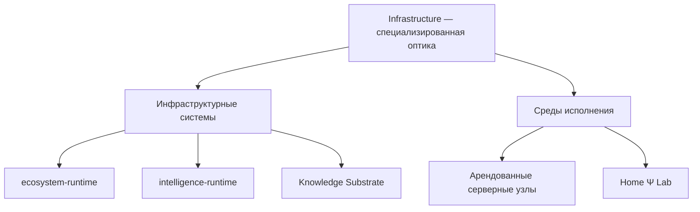

# Infrastructure

Infrastructure — это специализированная оптика, через которую экосистема
рассматривает техническую основу своей работы: исполняемый код, данные,
вычислительные среды, связи между ними и границы ответственности. Она не
подменяет продуктовую карту DETai и не превращает всё увиденное в один проект.

## Два вида объектов

Внутри этой оптики есть два больших направления: **инфраструктурные системы**
и **среды исполнения**.

### Инфраструктурные системы

Это самостоятельные versioned-контуры, которые владеют технической логикой и
данными. В текущей архитектуре таких систем три:

- [ecosystem-runtime](ecosystem-runtime/index.md) содержит общий backend DETai:
  API, Telegram-ботов, фоновые workers и схемы runtime-данных для пользователей,
  доступа, событий, заявок и уведомлений;
- [intelligence-runtime](intelligence-runtime/index.md) подключает правила
  продуктов к LLM: проводит запрос через нужные шаги, проверяет и исправляет
  технические ошибки ответа, записывает ход выполнения и возвращает результат;
- [Knowledge Substrate](Knowledge_Substrate/index.md) хранит канонические
  документы, которые описывают экосистему DETai — включая страницу, которую вы
  сейчас читаете, — и собирает из них этот сайт базы знаний на MkDocs, а также
  структурированные записи и индексы для машинной обработки.

Их общая граница раскрыта в разделе
[«Инфраструктурные системы»](infrastructure-systems/index.md).

### Среды исполнения

Это вычислительные машины и операционные контуры, где запускается код. DETai
использует арендованные внешние серверы и собственную Home Ψ Lab. Их различие
и общая эксплуатационная граница раскрыты в разделе
[«Среды исполнения»](execution-environments/index.md).

## Capabilities как связи между владельцами

Инфраструктурные системы и среды исполнения остаются двумя классами объектов,
но этого недостаточно, чтобы описать зависимости между ними. Для этого
используется понятие **Infrastructure Capability**: стабильная техническая
возможность, которую provider предоставляет consumer через контракт.

Capability не является третьим типом машины или новой организационной
иерархией. Это способ описать зависимость так, чтобы consumer зависел от смысла
и интерфейса возможности, а не от конкретного host, proxy stack или другой
сменяемой реализации.

Например, Psi Gateway может предоставлять reusable Network capability, которую
используют Telegram-facing runtime и другие компоненты. То, что consumer сегодня
размещён на DETai Nexus, не делает Nexus обязательным логическим посредником и
не передаёт ему ownership consumer-логики.

Подробно provider–consumer pattern, logical Network Profile, разделение policy
и роль operational repository описаны в
[«Принципах инфраструктуры»](Infrastructure_Principles.md#5-принцип-infrastructure-capabilities-и-стабильных-контрактов).

## Канон и operational source of truth

Эта база знаний хранит устойчивую концептуальную модель Infrastructure.
Отдельный `DETai-org/Infrastructure` repository является version-controlled
**operational source of truth** инфраструктурного домена: в нём могут храниться
reviewable operational-карты, инвентаризация, scripts, эксплуатационная
документация и подходящие для Git deployment/configuration assets.

Сам факт существования этого repository не создаёт четвёртую Infrastructure
System. Repository и Linux machine — разные объекты, так же как repository и
runtime system — не синонимы.

## Где проходит граница

Эта база знаний объясняет устойчивую структуру и связи понятным языком.
Конкретные адреса, регионы, провайдеры, пути, сервисы, конфигурации и текущее
размещение репозиториев относятся к операционным источникам Infrastructure.
Текущая внутренняя структура `DETai-org/Infrastructure` также является
изменяемой implementation detail и не канонизируется как вечное дерево.
