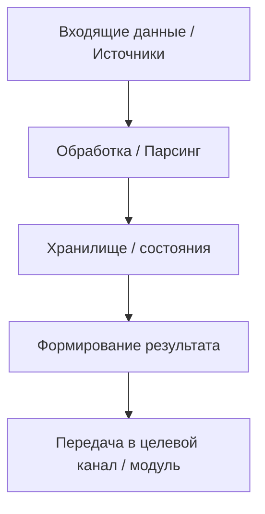

# README-template


- **README — это “навигация проекта”, а не оперативный журнал.**  
  Он должен **объяснять, но не жить**.  
  В нём фиксируются **Короткое описание, структура, 🔀 Цепочка передачи параметров от скрипта к скрипту (Схема: Поток)**. 
Он должен формироваться:
1. В начале (папки название скриптов Возможно даже функций всё это создаётся опираясь идею)
2. По ходу (в основном кодексом который добавляя новые элементы фиксирует это) для этого должна быть соответствующая политика
3. После того как версия проекта завершена содержать четкое структурное описание _где, что, и за что отвечает_ где вход проект с точки зрения кода.


Универсальный шаблон README.md

---

````markdown
# {{PROJECT_NAME}} | v{{PROJECT_VERSION}}

🔰 {{Короткое общее описание сути проекта — что он делает, зачем существует (без деталей реализации).}}

## 🧾 Краткое описание версии

{{Описание именно текущей версии проекта — какие изменения, улучшения, переработки или обновления внесены по сравнению с предыдущими.}}

♻️ **Статус версии**
> Текущая версия: **v{{PROJECT_VERSION}}**
> Статус: **{{в разработке / активна / завершена}}**
> Дата открытия: **{{YYYY-MM-DD}}**
> Дата закрытия (если завершена): **{{YYYY-MM-DD}}**

См. 🗂️ Хронология версий (`Chronology_versions/`)

---

## 📖 Оглавление

<!-- Это шаблон. При генерации на GitHub или в Codex пункты становятся кликабельными. -->
- [Запуск](#запуск)
- [Описание элементов проекта](#описание-элементов-проекта)
- [Схема](#схема)
- [Метаданные документа](#метаданные-документа)

---

## 🚀 Запуск

```bash
{{команда_1}}
```
{{Короткое описание, что делает эта команда. С вставками в начало > т.е. не просто текст, а **врезка**, **пояснение** или **комментарий** к команде}}

```bash
{{команда_2}}
```

{{Если нужно — пояснение, что выполняет команда, и в каких случаях используется.С вставками в начало > т.е. не просто текст, а **врезка**, **пояснение** или **комментарий** к команде}}

_(каждая команда оформляется так, чтобы можно было скопировать одним кликом)_

---
## 🧱 Описание элементов проекта

> Полную структуру директорий см. в файле  
> 📄 [`Directory_structure.txt`](Directory_structure.txt)

> В этом разделе описывается содержимое основных элементов проекта,  
> исходя из мозаической структуры (stage, utils, router и др.).  
> Здесь указывается, **что конкретно находится** в каждой части проекта —  
> без повторения их общих функций, описанных в техническом стандарте.

---

### 🧩 1. Этапы пайплайна (`pipeline/`)

Каждый `stage` — это логический шаг обработки данных или бизнес-операции.  
Ниже перечислены этапы, реализованные в этом проекте.

#### ▶️ one_stage_{{название}}
> {{Краткое описание, что делает данный stage — например, «сбор данных из источников», «парсинг контента», «инициализация карточек» и т.д.}}  
🗄️ [README]({{PROJECT_NAME}}/pipeline/one_stage_{{название}}/README.md) — если существует.

#### ▶️ two_stage_{{название}}
> {{Описание второго этапа: его роль, результат, что передаёт дальше.}}  
🗄️ [README]({{PROJECT_NAME}}/pipeline/two_stage_{{название}}/README.md) — если существует.

#### ▶️ three_stage_{{название}}
> {{Описание третьего этапа: например, форматирование, отправка, сбор аналитики.}}  
🗄️ [README]({{PROJECT_NAME}}/pipeline/three_stage_{{название}}/README.md) — если существует.
{{ Если этапов больше, добавляйте новые блоки по аналогии}}

### ⚙️ 2. Технические утилиты (`utils/`)
{{ краткое описание Какие конкретно там утилиты}}
🗄️ [README]({{PROJECT_NAME}}/utils/README.md) — если существует.


### 🧭 router/

{{Описание логики роутера: как он определяет последовательность выполнения этапов, какие режимы доступны.Роутер у нас появляется только в конце потому что мы руководствуемся принципом от частного к общему }}  


---

### 🧰 Скрипты и вспомогательные инструменты (`scripts/`)

> {{Какие вспомогательные или сервисные скрипты присутствуют, их предназначение.}}  
🗄️ [README]({{PROJECT_NAME}}/scripts/README.md) — если существует.

---

### 🔌 Коннекторы (`connectors/`)

> {{Описание подключений к внешним инструментам см. Наш технический Стандарт 🗄️ [README](tools/README.md)   


### 📊 Статистика / аналитика (`statistics/`)

> {{Если в проекте есть аналитическая подсистема — кратко описать, какие данные она собирает и зачем.}}  
🗄️ [README]({{PROJECT_NAME}}/statistics/README.md) — если существует.

---

### 🪄 Пресеты и шаблоны (`presets/`, `templates/`)

> {{Если в проекте применяются шаблоны или пресеты — описать их роль.}}  
🗄️ [README]({{PROJECT_NAME}}/presets/README.md) — если существует.


###  Апгрейды (`upgrades/`)

> {{Описание текущих мелких улучшений и промежуточных патчей, если они есть.}}  
🗄️ [README]({{PROJECT_NAME}}/upgrades/README.md) — если существует.

---

> 🟡 **Примечание:**  
> Ссылки на под-README добавляются **только если они реально существуют** в соответствующих каталогах.  
> Если файла `README.md` в разделе нет — ссылка опускается, а описание раздела остаётся.

---
---

## 🕸️ СХЕМА



_(Здесь отображается общая логика взаимодействия компонентов проекта. Схема заменяется на актуальную при внедрении.)_

---

♻️ Метаданные
- Структура оформлена по **техническому стандарту U.L.I. v1.0**
````

---

💡 **Ключевые принципы этого шаблона:**
1. **Никаких конкретных данных** — только структура и пример формата.  
2. **Оглавление — универсальное**, не заполняется заранее, просто демонстрирует принцип.  
3. **Раздел “Запуск”** — включает команды, готовые к копированию.  
4. **Раздел “Описание элементов проекта”** — не дублирует структуру, а ссылается на `Directory_structure.txt` и локальные README.  
5. **Схема** — всегда внизу, с placeholder'ом под mermaid.  
6. **Метаданные** — фиксируют принадлежность к стандарту **U.L.I. v1.0** и версию самого шаблона.  

